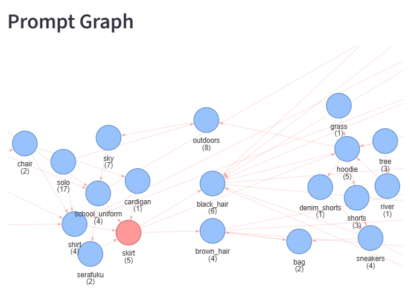
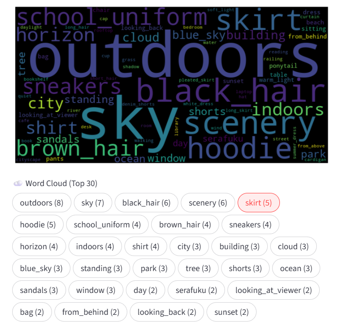
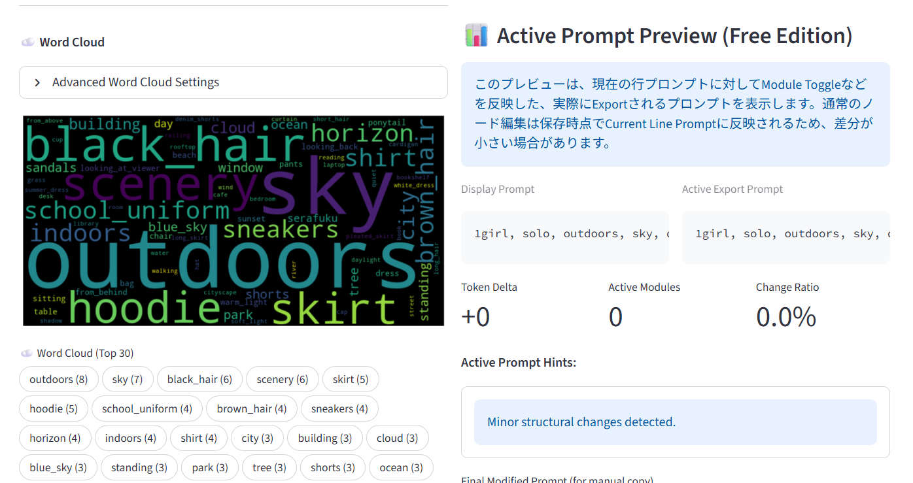

# PromptGraph Lite

A prompt IDE for managing and optimizing prompt collections.

Designed not for single image editing, but for refining entire prompt sets.

---

## 🧠 What is this?

PromptGraph Lite is a tool for working with **prompt collections**, not just individual prompts.

Instead of editing one image at a time, you can:

* Visualize prompt relationships as a graph
* Edit tokens safely across multiple prompts
* Understand how changes affect your whole dataset

---

## ✨ Features (Lite)

* 🔗 Prompt Graph Visualization
* ☁️ Word Cloud Analysis
* ✏️ Token-level Editing
* 🎯 Focus Edit Mode (single-line safe editing)
* 👁️ Active Prompt Preview

---

## 🚀 Why PromptGraph?

Most tools focus on generating **one image**.

PromptGraph is built for creators who:

* Manage large prompt sets
* Create variations and series
* Need consistency across outputs

👉 This is a tool for **editing prompt collections**, not just prompts.

---

## 🖼️ Screenshots

### Prompt Graph


Merge identical words to simplify the graph and understand structure instantly.

> Graph layout will be improved in future updates.

### Word Cloud


### Focus Edit Mode


---

## 📦 Installation

```bash
git clone https://github.com/prompt-graph-lab/promptgraph-lite.git
cd promptgraph-lite
pip install -r requirements.txt
streamlit run app.py
```

---

## 📁 Usage

1. Load a directory containing prompt text files
2. Explore the graph and word cloud
3. Select nodes to analyze relationships
4. Use Focus Edit Mode for safe editing

---

## 🔓 Pro Version

PromptGraph Pro unlocks advanced features:

* Batch editing across prompt sets
* Faster workflow tools
* Advanced structural operations

👉 Available via FANBOX:
[https://promptgraph.fanbox.cc](https://promptgraph.fanbox.cc/)

---

## 💡 Support

If you find this tool useful, consider supporting development:

👉 [https://promptgraph.fanbox.cc](https://promptgraph.fanbox.cc/)

---

## ⚠️ Notes

* This tool requires prompt text files (not just images)
* Best used for managing multiple prompts / datasets

---

## 📄 License

MIT License
