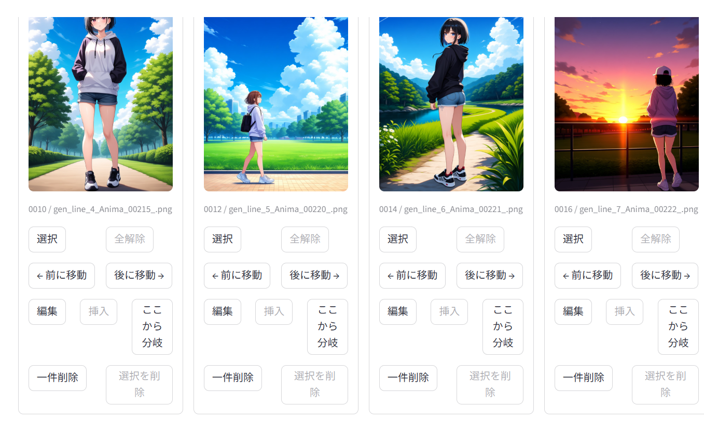
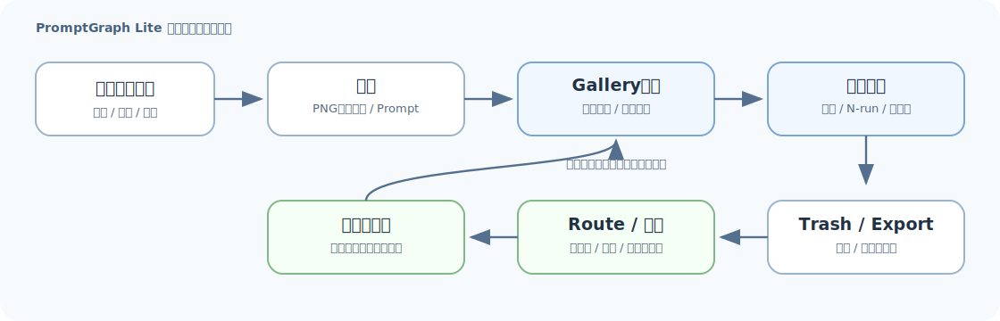

# PromptGraph Lite

PromptGraph Lite is a lightweight Gallery-first editor for building AI illustration sequences from prompts, PNG metadata, and ComfyUI-generated candidates.

PromptGraph Liteは、プロンプト・PNGメタ情報・ComfyUI生成候補を使ってAIイラスト集を組み立てる、Gallery中心の軽量編集ツールです。



Edit prompts, generate candidates, and insert only the good images into the main sequence.

プロンプトを編集し、候補画像を生成し、良いものだけを本編列へ追加できます。

---

## What It Does

PromptGraph Lite is not just a prompt viewer or graph visualization tool. It is a practical workspace for reviewing, editing, generating, branching, recovering, and exporting AI illustration sequences.

PromptGraph Liteは、単なるプロンプトビューアやグラフ表示ツールではありません。AIイラスト集を見ながら編集し、候補生成・分岐整理・復帰・出力まで行うための作業環境です。

The graph and PromptCloud views still exist, but they are now secondary overview tools. The main workflow starts from the image gallery.

グラフとPromptCloudは、イラスト集全体の構造を確認するための補助ビューです。日常的な編集はGallery Edit Modeから始まります。

---

## Gallery-First Workflow



1. Create or open a project.
2. Import PNG metadata, prompt text files, image folders, or an existing project.
3. Review the illustration sequence in Gallery Edit Mode.
4. Delete unwanted illustrations or restore them from Trash View.
5. Edit generation source prompts inline beside each image.
6. Generate candidates with ComfyUI, including N-run and gallery-wide generation.
7. Insert good candidates directly after the source illustration.
8. Organize routes with separators, route switching, collapse, colors, and branch actions.
9. Export prompt/image sets with metadata-safe public output options.

基本の流れ:

1. プロジェクトを作成または開きます。
2. PNGメタ情報、プロンプトtxt、画像フォルダ、既存project.jsonを読み込みます。
3. Gallery Edit Modeでイラスト列を確認します。
4. 不要なイラストを削除し、必要ならTrash Viewから復帰します。
5. 各イラストの横で生成ソース（プロンプト）を直接編集します。
6. ComfyUIで候補を生成します。N回生成やGallery全生成にも対応します。
7. 良い候補だけを元イラストの直後へ追加します。
8. ルート区切り、ルート切替、折りたたみ、色、分岐ボタンで流れを整理します。
9. メタデータ安全化付きで、生成ソースと画像セットを出力します。

---

## Main Features

- Gallery Edit Mode as the main workflow
- Inline prompt editing beside images
- Prompt-only line creation for starting from text
- PNG metadata import for generated AI illustration assets
- Folder import for prompt/image collections
- ComfyUI `workflow_api.json` generation
- Embedded PNG ComfyUI workflow support
- Force shared workflow option for consistent generation
- Single-line generation, N-run generation, and gallery-wide generation
- Candidate images attached to each illustration line
- Candidate insertion into the main sequence
- Manual external candidate image import
- Multi-select sequence insertion and reorder controls
- Route separators, route switch display, route collapse, route colors, and branch actions
- Trash View Mode for restoring deleted illustrations
- Project folders, `project.json`, recent projects, and autosave
- Prompt Graph and PromptCloud as secondary overview tools
- Prompt TXT export
- Prompt/image set export with metadata-safe PNG cleanup

主な機能:

- Gallery Edit Modeを中心にした編集
- 画像を見ながら生成ソース（プロンプト）を直接編集
- テキストだけのPrompt Line作成
- PNGメタ情報からの読み込み
- フォルダ内のプロンプト/画像読み込み
- ComfyUI `workflow_api.json` による生成
- PNG埋め込みComfyUIワークフロー対応
- 共通ワークフロー強制使用オプション
- 1枚生成、N回生成、Gallery全生成
- 各イラストに紐づく候補画像
- 良い候補を本編列へ直後追加
- 外部生成済み画像の候補追加
- 複数選択による並び替え/挿入
- ルート区切り、ルート切替、折りたたみ、色、分岐操作
- 削除済みイラストを復帰できるTrash View
- project.json、最近のプロジェクト、自動保存
- 補助ビューとしてのPrompt Graph / PromptCloud
- プロンプトtxt出力
- 公開向けメタデータ削除付きの画像/生成ソースセット出力

---

## Core Concepts

### Illustration Line

An illustration line is one item in the active sequence. It can hold an original/reference image, generation source prompt, PNG metadata, and generated candidates.

Illustration Lineは、本編列の1項目です。元画像、生成ソース（プロンプト）、PNGメタ情報、生成候補を保持できます。

### Candidates

Generated or manually added images stay as candidates until you choose to insert them. Inserting a candidate creates a new line immediately after the source line; it does not overwrite the original image.

生成または手動追加された画像は候補として保持されます。候補を選ぶと、元Lineを上書きせず、その直後に新しいLineとして追加されます。

### Routes

Lite uses lightweight route separators rather than a full DAG editor. Separators can be colored, collapsed, switched, and created with the branch action.

Liteのルート機能は、本格DAGではなく軽量な区切り表示です。区切りには色、折りたたみ、切替、分岐作成を使えます。

### Trash View

Deleting an illustration removes it from the active gallery, but it does not delete the source image file from disk. Deleted lines can be restored from Trash View.

削除はプロジェクト上の一覧から外すだけで、元画像ファイルは削除しません。削除済みLineはTrash Viewから復帰できます。

---

## ComfyUI Workflow Support

PromptGraph Lite can generate candidates through ComfyUI using an API-format `workflow_api.json`.

PromptGraph Liteは、API形式の `workflow_api.json` を使ってComfyUIから候補画像を生成できます。

Supported workflow behavior:

- Use embedded PNG workflow metadata when available.
- Fall back to shared `workflow_api.json`.
- Optionally force the shared workflow and ignore embedded workflows.
- Generate one line, run multiple generations for one line, or generate across a route/project.

対応内容:

- PNGに埋め込まれたワークフローを利用
- 共通の `workflow_api.json` へフォールバック
- 埋め込みワークフローを無視して共通ワークフローを強制使用
- 1Line生成、N回生成、ルート/プロジェクト全体生成

---

## Export And Public Safety

Lite can export prompt/image sets in sequence order. Public-safe export can strip PNG metadata so local paths, workflow data, and environment information are not carried into shared images by default.

Liteは、イラスト列の順番で生成ソースと画像セットを出力できます。公開向け出力では、PNG内のローカルパス、ワークフロー、環境情報などを削除する安全化を既定で重視しています。

---

## Lite vs Pro

### PromptGraph Lite

Lite focuses on practical illustration-sequence editing:

- import existing assets
- edit prompts beside images
- generate and compare candidates
- insert good images into the sequence
- organize lightweight routes
- restore deleted items
- export safely

Liteは、実用的なAIイラスト集編集に集中します:

- 既存素材を読み込む
- 画像を見ながらプロンプトを直す
- 候補を生成して比較する
- 良い画像だけを本編列に追加する
- 軽量ルートで整理する
- 削除済みを復帰する
- 安全に出力する

### PromptGraph Pro

Pro focuses on advanced prompt and graph operations:

- batch editing
- module editing
- advanced graph/prompt structure editing
- larger automation-oriented workflows
- future API / agent workflows

Proは、より高度なプロンプト/グラフ操作に向けた版です:

- 一括編集
- Module編集
- 高度なグラフ/プロンプト構造編集
- 大規模な自動化ワークフロー
- 将来的なAPI/エージェント連携

---

## Screenshots

### Gallery Edit Mode


### Prompt Graph


Graph and PromptCloud help inspect repeated words and project-wide prompt relationships.

グラフとPromptCloudは、繰り返し使われるワードやプロジェクト全体のつながりを確認するための補助ビューです。

### PromptCloud


### Focus Edit Mode


Focus Edit remains available, but Gallery Edit Mode is the main Lite workflow.

Focus Editも残っていますが、Liteの主導線はGallery Edit Modeです。

---

## Demo

Streamlit Cloud demo:

https://promptgraph-lite.streamlit.app/

The Streamlit Cloud version is mainly for UI preview, Gallery workflow preview, and browsing the included sample dataset. ComfyUI generation is not available in the cloud demo, so real generation workflows are best run locally.

Streamlit Cloud版はUI確認・Galleryワークフロー体験・サンプルデータ閲覧用です。ComfyUI生成は利用できないため、実際の生成ワークフローにはローカル実行をおすすめします。

---

## Included Sample Dataset / サンプルデータ

This repository includes sample PNG files with embedded metadata, so you can immediately test PNG metadata import, Gallery editing, route organization, candidate workflows, and ComfyUI workflow loading without preparing your own dataset first.

このリポジトリにはメタ情報付きPNGサンプルが含まれているため、自分のデータセットを準備しなくても、PNGメタ情報読み込み、Gallery編集、ルート整理、候補ワークフロー、ComfyUIワークフロー読み込みをすぐ試せます。

---

## Installation

### Local Launch

```bash
pip install -r requirements.txt
streamlit run app.py
```

or:

```bat
run.bat
```

---

## Support / FANBOX

Project page and support:

https://promptgraph.fanbox.cc/

---

## Roadmap

Near-term direction:

- improve Gallery Edit Mode for larger projects
- refine route/branch workflows without overcomplicating Lite
- keep candidate insertion fast and understandable
- improve ComfyUI generation reliability and workflow selection
- keep public-safe export simple
- keep graph and PromptCloud useful as overview tools

今後の方向性:

- 大きなイラスト集でも使いやすいGallery編集
- Liteらしい軽量なルート/分岐整理
- 候補追加ワークフローの改善
- ComfyUI生成とワークフロー選択の安定化
- 公開向け安全出力の改善
- 全体把握用のグラフ/PromptCloudの改善

Future advanced graph editing, full route DAGs, and automation-heavy workflows are more Pro-oriented.

高度なグラフ編集、本格的なDAGルート、強い自動化ワークフローはPro側で育てる予定です。

---

## Disclaimer

PromptGraph Lite is experimental and workflow-driven. The UI and project structure may continue to evolve as real illustration workflows are tested.

PromptGraph Liteは実験的なワークフロー検証中のツールです。実際のイラスト制作フローに合わせてUIや構造が変化する可能性があります。

---

## License

MIT License
